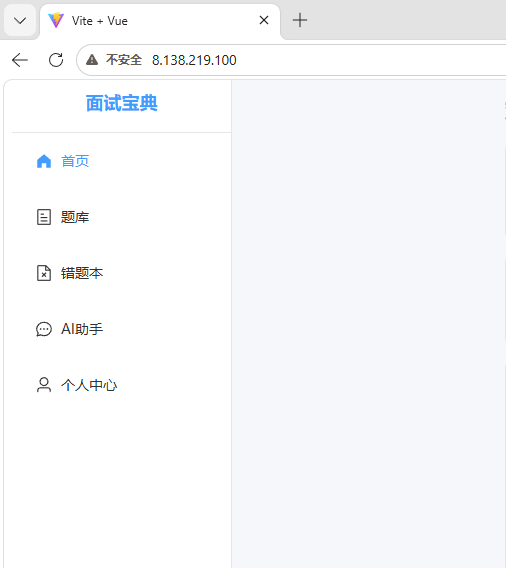
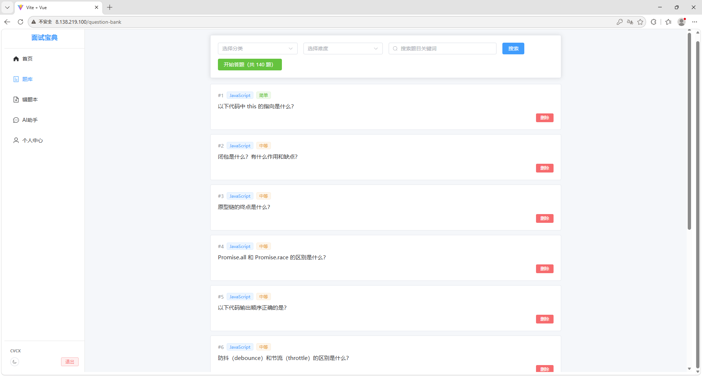
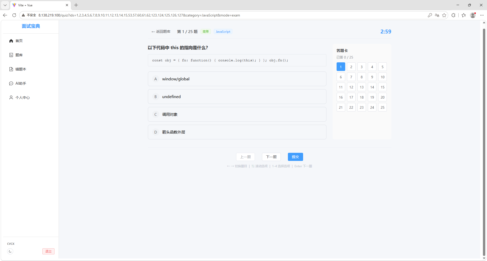
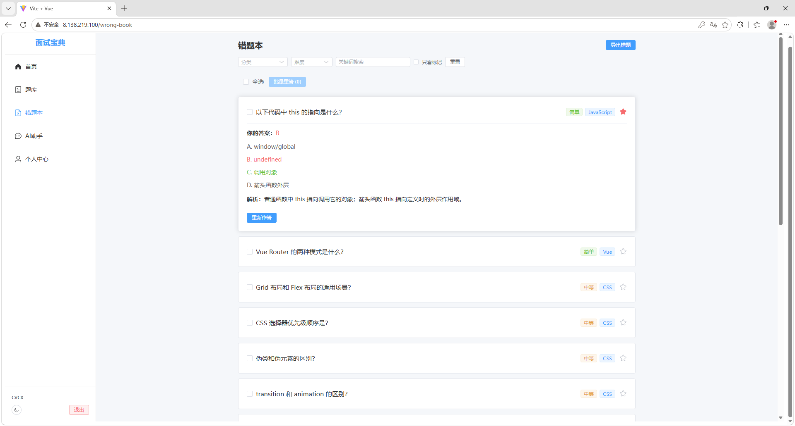
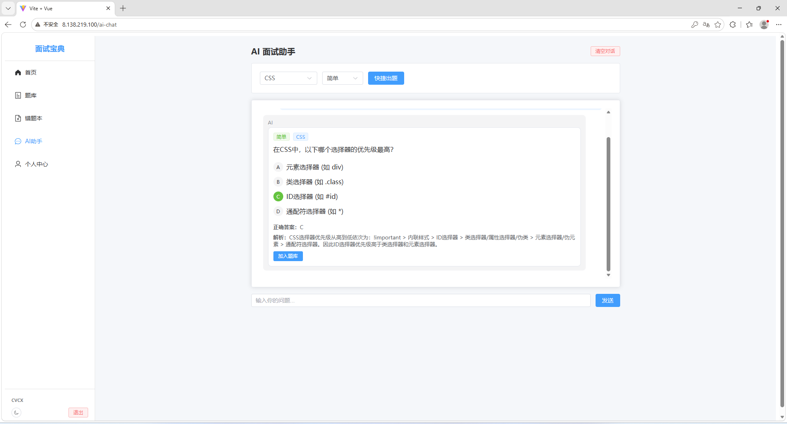

# 面试宝典（Interview Handbook）

> AI 驱动的面试刷题助手 — 题库练习 + 错题本 + 智能统计 + AI 出题对话

**🌐 在线演示**：http://8.138.219.100

---

## 📸 功能截图

### 首页概览

*快速进入答题或 AI 对话*

### 题库列表

*按分类/难度筛选，关键词搜索，分页浏览*

### 答题界面

*逐题作答，答题卡跳转，倒计时，自动评分*

### 错题本

*自动收集错题，展开解析，批量重答，三次答对自动移除*

### 统计仪表盘

*答题数/正确率/每日趋势/分类统计/薄弱知识点 TOP5*

### AI 助手

*SSE 流式对话，按分类/难度出题，推理过程展示，一键加入题库*

---

## 📹 演示视频

> [夸克网盘] 面试宝典 Demo（无需下载，在线播放）
>
> **链接**：https://pan.quark.cn/s/e74103dba761

---

## 🚀 功能概览

| 模块 | 功能 |
|------|------|
| 用户系统 | 注册 / 登录 / JWT 认证 / 修改用户名密码 |
| 题库 | 分类筛选 / 难度筛选 / 关键词搜索 / 分页浏览 / 题目详情 |
| 答题 | 逐题作答 / 答题卡跳转 / 倒计时 / 自动评分 |
| 错题本 | 自动收集 / 展开解析 / 标记 / 批量重答 / 三次答对自动移除 |
| 统计仪表盘 | 答题数 / 正确率 / 每日趋势 / 分类统计 / 薄弱知识点 TOP5 |
| AI 助手 | SSE 流式对话 / 按分类难度出题 / 推理过程展示 / 一键加入题库 |
| 暗黑模式 | 全局暗黑主题 / ECharts 图表动态配色 |
| 响应式 | 双断点适配（768px 平板 + 480px 手机）/ 移动端汉堡菜单 |

---

## 🛠 技术栈

### 前端
- **Vue 3**（Composition API + `<script setup>`）
- **Vite 5** — 构建工具
- **Vue Router 4** — 路由管理（history 模式）
- **Pinia 3** — 状态管理
- **Element Plus** — UI 组件库（含内置暗黑主题）
- **ECharts 6** — 数据可视化
- **Axios** — HTTP 请求

### 后端
- **Express 5** — Web 框架
- **bcryptjs** — 密码加密
- **jsonwebtoken** — JWT 认证
- **dotenv** — 环境变量管理
- **JSON 文件存储** — 零数据库依赖，适合个人/小规模使用

### AI 集成
- **DeepSeek V4 Flash** — 大语言模型
- **SSE（Server-Sent Events）** — 流式输出
- **双通道输出** — `reasoning_content`（推理过程）+ `content`（正文）

### 部署
- **阿里云轻量应用服务器** — Ubuntu 22.04 / 2核2G
- **Nginx** — 反向代理 + 静态资源托管 + SSE 透传
- **PM2** — Node.js 进程管理
- **Node.js 20 LTS** — 运行时

---

## 📦 本地运行

**前置要求**：Node.js 20+

```bash
# 1. 克隆仓库
git clone https://github.com/xueca/interview-handbook.git
cd interview-handbook

# 2. 安装后端依赖
cd backend
npm install

# 3. 配置环境变量（可选，不配置则使用默认值）
cp .env.example .env
# 编辑 .env 设置 DEEPSEEK_API_KEY 等

# 4. 启动后端（端口 5000）
node app.js

# 5. 安装前端依赖（新终端）
cd ../frontend
npm install

# 6. 启动前端开发服务器（端口 5173）
npm run dev
```

访问 http://localhost:5173

---

## 🚢 生产部署

### 一键部署

```bash
# 在服务器上执行
chmod +x deploy.sh
./deploy.sh
```

### 手动部署

```bash
# 1. 拉取代码
git pull origin reborn

# 2. 安装后端依赖
cd backend && npm ci --production

# 3. 构建前端
cd ../frontend && npm ci && npm run build

# 4. 配置 Nginx
sudo cp ../nginx/interview-handbook.conf /etc/nginx/sites-available/
sudo ln -s /etc/nginx/sites-available/interview-handbook /etc/nginx/sites-enabled/
sudo nginx -t && sudo systemctl restart nginx

# 5. 启动/重启后端
cd .. && pm2 start ecosystem.config.js --env production
```

### Nginx 配置要点

SSE 流式输出需要特殊配置：

```nginx
location /api/ {
    proxy_pass http://localhost:5000;
    proxy_buffering off;
    proxy_cache off;
    proxy_read_timeout 3600s;
}
```

---

## 🏗 架构设计

### 前端数据流（单向）

```
views/*.vue  →  composables/use*.js  →  api/*.js  →  backend
     ↑              ↓ 返回响应式数据      ↓ 返回 Promise
     └──────────────┴────────────────────┘
```

### 后端分层

```
routes/*.js  →  controllers/*.js  →  services/*.js  →  data/index.js
                                            ↓
                                      DeepSeek API
```

### 部署架构

```
                    公网用户
                       ↓
                  [ Nginx :80 ]
                  /          \
    静态资源 /          /api/ 反向代理
        ↓                    ↓
  frontend/dist/      backend (Express :5000)
  (Vue SPA)           (PM2 管理)
                            ↓
                     DeepSeek API (SSE)
                     JSON 文件存储
```

---

## 📋 API 接口

### 认证
| 方法 | 路径 | 说明 |
|------|------|------|
| POST | `/api/auth/register` | 用户注册 |
| POST | `/api/auth/login` | 用户登录 |
| GET | `/api/auth/me` | 获取当前用户信息 |
| PUT | `/api/auth/password` | 修改密码 |
| PUT | `/api/auth/username` | 修改用户名 |

### 题库
| 方法 | 路径 | 说明 |
|------|------|------|
| GET | `/api/questions` | 题库列表（支持筛选/搜索/分页） |
| GET | `/api/questions/:id` | 题目详情 |
| POST | `/api/questions` | 创建题目（AI 生成入库） |
| DELETE | `/api/questions/:id` | 删除题目 |

### 答题记录
| 方法 | 路径 | 说明 |
|------|------|------|
| POST | `/api/records` | 提交答题记录 |
| GET | `/api/records` | 获取答题记录 |
| GET | `/api/records/stats` | 获取统计数据 |
| GET | `/api/records/wrong` | 获取错题列表 |
| POST | `/api/records/mark` | 切换标记状态 |
| GET | `/api/records/marks` | 获取标记列表 |

### AI
| 方法 | 路径 | 说明 |
|------|------|------|
| POST | `/api/ai/generate` | AI 非流式出题 |
| POST | `/api/ai/generate/stream` | AI 流式出题（SSE） |
| POST | `/api/ai/chat` | AI 非流式对话 |
| POST | `/api/ai/chat/stream` | AI 流式对话（SSE） |

---

## 📐 开发规范

本项目采用严格的架构约束体系，确保代码质量：

- **文件行数限制**：`.vue` ≤ 200 行，`.js` ≤ 150 行，函数 ≤ 30 行
- **单向数据流**：禁止视图层直接调用 API，必须通过 composable 层
- **反模式清单**：禁止组件内直接 fetch、裸 async 无 catch、timer 不清理等
- **质量工具链**：ESLint 自定义架构插件 + Husky 钩子 + MCP Code Guardian

详见 `.trae/rules/` 目录。

---

## 💾 数据备份

```bash
# 手动备份
cd backend/scripts
./backup-data.sh

# 自动备份（每天凌晨 3 点）
crontab -e
# 添加：0 3 * * * /var/www/interview-handbook/backend/scripts/backup-data.sh
```

备份文件保留 30 天，存储在 `backend/data/backups/`。

---

## ❓ 常见问题

### Q: 如何添加新题目？
1. 编辑 `backend/data/questions.json`
2. 或通过 AI 对话页生成题目后点击「加入题库」

### Q: 如何修改 AI 模型？
编辑 `backend/.env` 中的 `DEEPSEEK_API_KEY` 和 `DEEPSEEK_MODEL`。

### Q: SSE 流式输出不工作？
检查 Nginx 配置中 `/api/` 路径是否包含：
```nginx
proxy_buffering off;
proxy_cache off;
proxy_read_timeout 3600s;
```

---

## 📄 许可证

MIT License

---

## 🙏 致谢

- [DeepSeek](https://www.deepseek.com/) — AI 模型支持
- [Element Plus](https://element-plus.org/) — UI 组件库
- [ECharts](https://echarts.apache.org/) — 数据可视化
