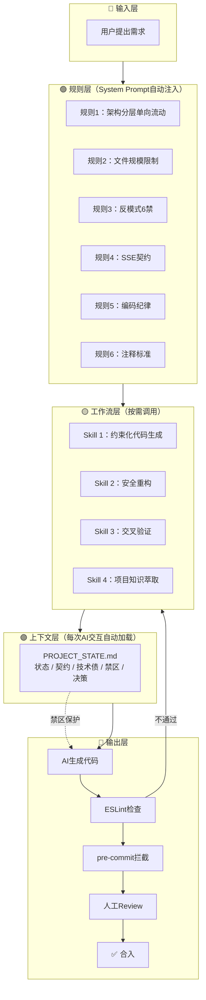

# 面试宝典（Interview Handbook）

AI 面试刷题助手，基于 Spec Coding 方法论的全栈项目。

## AI 协作架构

本项目采用 Spec Coding 方法论，通过 6 条规则 + 4 个 Skill + 上下文管理中心，实现 AI 辅助编码的规范化。



- **6条规则**：架构分层 / 文件规模 / 反模式 / SSE契约 / 编码纪律 / 注释标准
- **4个Skill**：约束化生成 / 安全重构 / 交叉验证 / 项目教学
- **上下文管理**：PROJECT_STATE.md 统一管理接口契约、技术债、禁区清单
- **自动化验证**：ESLint + pre-commit 实现代码合规率 100%（0 Error）

详见 [.trae/](./.trae/) 目录。

## 技术栈

| 层 | 技术 |
|---|------|
| 前端 | Vue3(Composition API) + Vite + Element Plus + Pinia + ECharts |
| 后端 | Express5 + JWT + JSON 持久化 |
| AI | DeepSeek API + SSE 流式输出 |
| 工程化 | ESLint + Husky + Spec Coding 规则体系 |

## 快速开始

```bash
# 前端
cd frontend && npm install && npm run dev

# 后端
cd backend && npm install && npm run dev
```

## 线上地址

开发中，部署后替换此链接。

## 开发日志

- [踩坑记录](./踩坑记录.md)
- [AI协作架构（完整版）](./.trae/documents/architecture.mmd)
- [执行计划](./.trae/documents/AI×文档工程-执行计划.md)